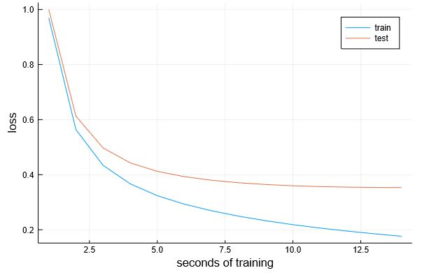
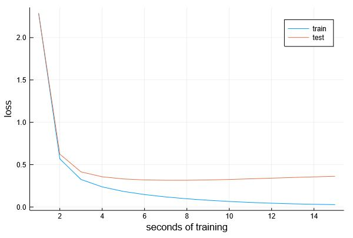

# Handwritten-Digit-Recognition-using-MNIST-dataset-and-Julia-Flux

I did the "**Deep Learning with Flux**" course provided by **Julia Academy** (https://juliaacademy.com/courses/). I express my sincere gratitude to **Dr. Matt Bauman** for presenting this course and sharing the associated Jupyter Notebook. This notebook is associated with fourth lecture "**Recognizing handwriting with a neural network**" of the mentioned course.

As I was attending the lecture, I realized I need to code myself to understand and record my inferences and in the process came up with this working notebook. Intent here is to have this for my future reference as well as be useful to someone new to the field learning ML/DL.

This notebook implements a **neural network** using **Julia Flux** to **recognize handwritten digits** from **MNIST dataset**. 

Details of what this notebook covers is listed below:
- How to setup the Environment
- Where to get the datasets from 
- Which packages to install and how
- Understanding MNIST dataset
- Prepare input data
- Create output labels
- Use batch to improve efficiency and create training batch
- Define the model
- Train the model few times and observe improving loss value
- Show Loss automatically using callback
- Evaluate accuracy of prediction
- Update Model and improve accuracy

**Initial Model**
- **784 Inputs** -> **10 Outputs** with **Identity** Activation Function -> **Softmax**
- Loss Function = **Crossentropy**
- Optimizer Function = **ADAM**
- **Train** Accuracy = **96.36%**
- **Test** Accuracy = **89.88%**
- Total **Number of Parameters** of the Model = **7850**

**Updated Model**
- **784 Inputs** -> **20 hidden neurons** with **relu** as Activation Function) -> **10 Outputs** with **Identity** Activation Function -> **Softmax**
- Loss Function = **Crossentropy**
- Optimizer Function = **ADAM**
- **Train** Accuracy = **99.84%**
- **Test** Accuracy = **90.72%**
- Total **Number of Parameters** of the Model = **15910**

**Summary**
1. You can notice that the test loss is increasing after we added more complexity (more parameters) to the model i.e. it is overfitting => We need to **reduce the number of parameters or train with more samples**.
2. Our input is a 28x28 image, however, we are feeding it to the model as a vector which loses the spatial information of the one pixel to the other. And we did so because the the model topology (multi-layer perceptron) expects the input in a vetor form. Also we used the Dense function which connects every input to every output as needed for a multi-layer perceptron which probably could be adding more complexity than needed. We can alternatively go for a **model topology which retains the image structure** as a matrix for processing and connects few inputs to few outputs i.e. a Convolution Neural Network (CNN). 
